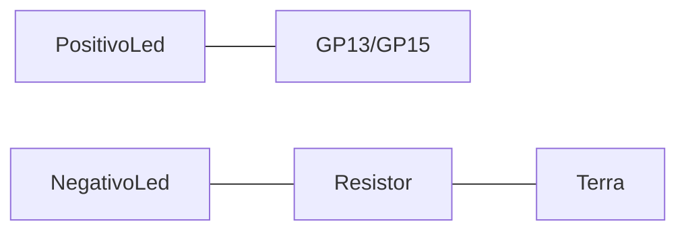

# servomotor

Um exemplo didático de como controlar servomotor utilizando um joystick.

## Uso:
  Cada eixo do Jostick controla a posição absoluta de um dos servomotores.
  O botão do Joystick troca entre os leds verde e amarelo.
  
## Componentes:
- 1 Led Verde (https://www.eletrogate.com/led-difuso-5mm-verde)
- 1 Led Amarelo (https://www.eletrogate.com/led-difuso-5mm-amarelo)
- 2 Resistores 220 ohms (https://www.eletrogate.com/resistor-220r-1-4w-10-unidades)
- 2 Servo Motores (https://www.eletrogate.com/servo-towerpro-sg-5010)
- 1 Joystick (https://www.eletrogate.com/modulo-joystick-analogico-para-arduino)
- 1 Raspberry Pico (https://www.eletrogate.com/raspberry-pi-pico)
- 1 Fonte 5V 1A (https://www.eletrogate.com/fonte-5v-1a)
- 1 Fonte USB (https://www.makerhero.com/produto/fonte-dc-chaveada-5v-2a-micro-usb)
- 1 Conector Adaptador Plug P4 Macho com Borne (https://www.makerhero.com/produto/conector-adaptador-plug-p4-macho-com-borne)
- 1 Proboard 400 pontos (https://www.eletrogate.com/protoboard-400-pontos)
- Jumpers Macho-Macho cores diversas (https://www.eletrogate.com/jumpers-macho-macho-20-unidades-de-20-cm)
  
## Portas Raspberry Pico Usadas:
- 3 GND: Terra
- 17 GP13: Positivo Led Amarelo
- 20 GP15: Positivo Led Verde
- 21 GP16: PWM ServoMotorY
- 23 GND: Terra
- 25 GP19: PWM ServoMotorX
- 31 GP26/ADC0: Joystick EixoY (VRY)
- 32 GP27/ADC1: Joystick EixoX (VRX)
- 34 GP28: Botão do Joystick (SW)
- 36 3V3V: Alimentação Joystick (+5V)
- 38 GND: Terra Joystick (GND)

## Alimentação:
-  Raspberrypico: Fonte USB
-  Motores: Fonte 5V 1A

  Não esqueçar de interligar os terras do Raspberry Pico da Fonte 5V 1A.\
  Não misturar 5V da fonte com 3,3V do Raspberry Pico, pois irá queimar o Raspberry Pico.
  
## Ligação Leds:
- Positivo (Perna Maior): Em uma saida digital do raspberry pico (17 GP13 para Amarelo e 20 GP15 para Verde)
- Negativo (Perna Menor/Lado Chanfro): Em um resitor de 220Ω e o resistor no terra

  
## Ligação Motores:
-  Fio Preto: Terra
-  Fio Vermelho: Fonte Alimentação 5V 1A
-  Fio Amarelo: Porta Raspberry Pico (21 GP16 MotorY e 25 GP19 MotorX)

## Ligação Joystick:
-  GND: Terra (38 GND)
-  +5V: Alimentação (36 3V3)
-  VRX: Porta com suporte conversão analógico digital (ADC) (32 GP27/ADC1)
-  VRY: Porta com suporte conversão analógico digital (ADC) (31 GP26/ADC0)
-  SW: Porta digital (34 GP28)

## Montagem:

# Video de Como Utilizar

[https://www.youtube.com/watch?v=3D3U0qgkGvI](https://youtu.be/u6eRrXPFQXM)

Clique no link acima para ser direcionado par ao YouTube.

